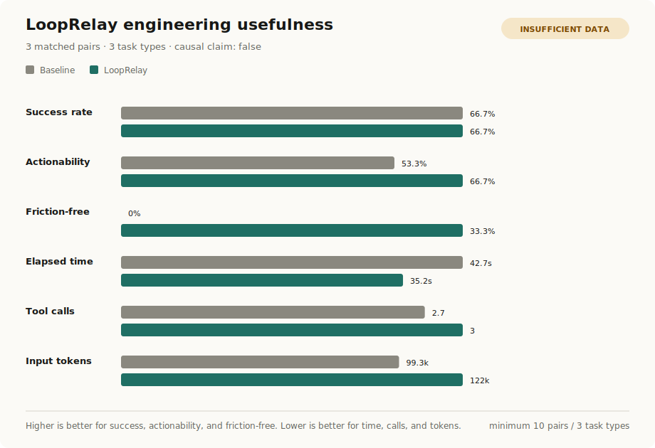
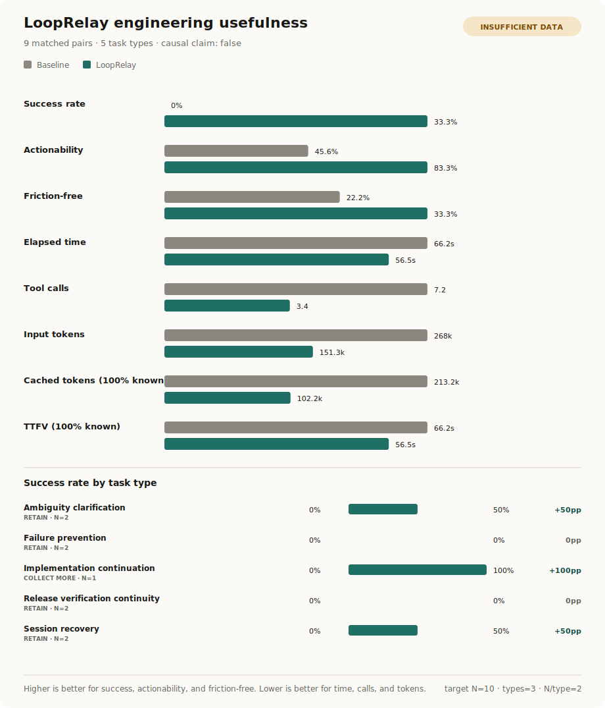

# LoopRelay

[English](README.md) | [한국어](README.ko.md)

**Local continuity and evidence for long-running Codex and Claude Code loops.**

- 🔁 Restores the selected session, worktree, branch, and compact-boundary
  state without scraping private agent transcripts.
- 📍 Produces an evidence-backed continuation brief for the next Codex or
  Claude Code session.
- ✅ Links prompts to passed, failed, blocked, or unknown outcomes instead of
  treating a higher prompt score as success.
- 🧠 Promotes only approved, evidence-bearing lessons into local memory or an
  AGENTS.md/CLAUDE.md patch proposal.
- 🧭 Detects recurring failure patterns across loops and asks focused questions
  instead of rewriting ambiguous requests by default.

## Measured Engineering Usefulness



<!-- USEFULNESS_RESULTS_START -->
Current results are maintainer-run observational evidence, not a causal claim. They include 30 matched pairs across 5 task types and 0/3 independent users. A separate cohort has 3 independent agent operators with 100% first-value success; agent operators do not count as human users.

| Task type | Pairs | Baseline success | LoopRelay success | Delta | Conservative 95% bound | Input-token delta | Decision |
| --- | ---: | ---: | ---: | ---: | ---: | ---: | --- |
| Ambiguity clarification | 6 | 83.3% | 50% | -33.3pp | -100..77.6pp | -8535.5 | Narrow |
| Failure prevention | 6 | 0% | 100% | +100pp | -10.9..100pp | +1777.7 | Retain |
| Implementation continuation | 6 | 100% | 83.3% | -16.7pp | -100..94.2pp | +34913.2 | Narrow |
| Release verification continuity | 6 | 100% | 100% | 0pp | -100..100pp | +42178.2 | Narrow |
| Session recovery | 6 | 16.7% | 83.3% | +66.7pp | -44.2..100pp | -25189 | Retain |

Aggregate success moved from 60% to 83.3%, while actionability moved from 74% to 89.7%. Mean input-token cost changed by 11.1%. Cached-token and TTFV condition coverage are 66.7% and 66.7% respectively; missing values are not interpreted as zero. All 5 target task types meet the per-type minimum of 5 pairs. Decisions remain directional because this is maintainer-run evidence and independent-user validation is incomplete. Because ordinary implementation continuation regressed, LoopRelay should not intervene by default in every coding task. The causal claim remains false until independent-user validation is complete.
<!-- USEFULNESS_RESULTS_END -->

This chart is generated from the committed raw-free matched-pair ledger, not
hand-edited marketing data. It shows outcome quality and operating cost
together, retains null and negative results, and displays `INSUFFICIENT DATA`
until at least 30 pairs across 5 task types and 5 pairs per type exist. The study is observational;
`causal_claim` always remains false.

```sh
pnpm evidence:usefulness
```

See the [raw-free pair ledger](reports/usefulness-pairs.json),
[generated summary](reports/usefulness-summary.json), and
[evaluation protocol](docs/ENGINEERING_USEFULNESS_VALIDATION_2026-07-11.md).
Independent humans use the
[install-to-first-value protocol](evaluation/usefulness/INDEPENDENT_USER_PROTOCOL.md);
agent operators do not satisfy that gate.

### Sol-planned, Terra-executed reproduction


A separate Codex 0.144.1 cohort used `gpt-5.6-sol` to preregister the rubric
before any outputs were observed and `gpt-5.6-terra` for both conditions. In
five counterbalanced pairs, baseline passed 4/5 and LoopRelay passed 5/5. Mean
TTFV was 47.4s versus 30.4s, mean input tokens were 85,171 versus 42,415, and
human review preferred LoopRelay in four pairs with one tie. Two initial Terra
calls hit model capacity and succeeded on retry; their end-to-end delay and
friction remain recorded. This small fixture-reuse cohort is a cross-model
reproduction check, not an independent-user or causal result, and is not mixed
into the 30-pair GPT-5.4 aggregate.

See the [cross-model ledger](reports/usefulness-sol-terra-pairs.json) and
[generated cross-model summary](reports/usefulness-sol-terra-summary.json).

### Unseen real-repository tasks



The first separate real-repository session-recovery pair was strict fail/fail:
baseline selected a different valid backlog item, while treatment recovered
the selected task but omitted secondary brief constraints. That failure led to
a focused checkpoint brief that removed inherited project prompt diagnostics.
On the baseline-first follow-up, position-swapped Sol review consistently
scored baseline fail and LoopRelay pass. Treatment used 38.28s, 3 tools, and
140,520 input tokens versus 64.13s, 20 tools, and 326,993 for baseline. These
two observational pairs are retained in the
[real-task ledger](reports/usefulness-real-task-pairs.json); they are not pooled
with synthetic cohorts and are too small for a general productivity claim.

A third real-task pair tested recovery from unsupported validation commands
and pre-existing repository formatting drift. Both conditions missed the
strict all-criteria threshold, but position-swapped Sol review scored the
failure-prevention concepts 0/5 for baseline and 4/5 for LoopRelay, preferring
LoopRelay in both orders. The result remains a formal fail/fail and motivated
removal of a stale generic Node gate from explicit checkpoint briefs.

The fourth pair tested the ambiguous request to update “the latest usefulness
graph.” Baseline asked about the result set and graph but omitted several
reporting decisions; LoopRelay asked all six preregistered questions and
withheld edits. Position-swapped Sol review scored LoopRelay 8/8 and baseline
4/8 to 5/8. Across four real-task pairs and three task types, strict success is
0% versus 50%, but the graph remains `INSUFFICIENT DATA`: the active threshold
is 10 pairs with at least two per type, and only one type currently meets that
minimum. See the [generated real-task summary](reports/usefulness-real-task-summary.json).

The fifth pair tested the live release boundary. Both conditions blocked
release and both failed the exact-fact rubric; LoopRelay recovered more
evidence blockers but cost slightly more and omitted public-artifact absence
facts. This exposed that safe checkpoint evidence refs were stored but not
rendered in the brief. They are now included under a privacy-filtered
`Checkpoint Evidence` section. The follow-up recovered every release fact and
reduced rediscovery, but still inserted a final gate before the required
version decision, so it remains fail/fail. Selected contracts now explicitly
forbid fallback steps between stated actions. The aggregate is nine pairs
across five types, with 0% baseline and 33.3% LoopRelay strict success; it
remains `INSUFFICIENT DATA` and is not a release authorization.

The seventh pair covered ordinary implementation continuation for this
evidence pipeline. Baseline chose plausible but different command and flag
names and broadened verification; LoopRelay recovered the exact focused plan
and passed, but took 7.52s longer and produced more output/reasoning tokens.
This supports exact selected-contract recovery, not a general speed claim.

The eighth pair was a distinct failure-prevention retrospective. Both
conditions found the existing secret-detector fix but could not run Vitest in
the read-only sandbox, so both formally failed. LoopRelay cut TTFV from 74.99s
to 47.57s and input tokens from 597,654 to 127,648, but baseline found an
additional browser-sanitizer drift and was preferred 7/10 versus 6–6.5/10.
This negative result shows that shorter rediscovery can miss useful adjacent
risk. The browser sanitizer and report-ledger privacy regexes were aligned by
focused regressions after the run.

The ninth pair tested the ambiguous request to move to “the next public
version.” Both conditions formally failed. Baseline inferred patch/minor
candidates and proposed release steps before clarification. LoopRelay asked
more of the required decisions and cut TTFV by 11.4s, but omitted an explicit
changelog-content question and mislabeled 8/10 real tasks as users. Sol
preferred LoopRelay while retaining score ranges of 1–2/5 versus 3–4/5. Four
of five task types now meet the two-pair minimum; the graph remains
`INSUFFICIENT DATA` until the final distinct implementation pair is complete.

Regenerate only the separate real-task artifacts without rewriting the 30-pair
README result blocks:

```sh
pnpm evidence:real-task
```

After the npm package is published:

```sh
npm install -g looprelay
looprelay setup --profile coach --register-mcp --open-web
# then collect and continue a real coding-agent loop:
looprelay loop collect
looprelay loop brief
```

Until then, run the same first coach loop from a local checkout:

```sh
git clone https://github.com/wlsdks/looprelay.git
cd looprelay
pnpm install
pnpm setup
pnpm looprelay loop collect
pnpm looprelay loop brief
```

LoopRelay is the local continuity and evidence layer for long-running coding-agent loops. It records safe loop state from Codex and Claude Code, ties work to outcome evidence, prepares the next-session handoff, and turns approved lessons into reviewable memory or instruction proposals. The npm package, CLI, MCP server, hook command, plugin, slash namespace, and data directory all use the `looprelay` identity.

Use `looprelay` in scripts, terminal commands, MCP registration, and plugin commands. Claude Code slash commands are exposed under the active `/looprelay:*` namespace.

`looprelay` is the only public CLI identity; no compatibility alias is shipped.

It stores redacted prompts and safe loop metadata locally, indexes them in
SQLite, and exposes recovery, continuation, outcome, memory, instruction, and
failure-pattern evidence through CLI, MCP, and a local review workspace.

LoopRelay does not execute the coding loop for you. It is the layer that keeps
the loop coherent and reviewable across disposable sessions and different
agents. It is not a transcript scraper, hidden provider proxy, or merge bot.

This project is not affiliated with, endorsed by, or sponsored by Anthropic, OpenAI, or any other AI tool provider. Product names such as Claude Code and Codex are used only to describe compatibility.

## First 3-Minute Continuity Loop

The first success is resuming real work without rediscovering the repository or
repeating a failed approach.

For most users, the happy path is:

```sh
looprelay start --open-web
looprelay setup --profile coach --register-mcp --open-web
# During the installation session, record a safe task checkpoint immediately.
looprelay loop checkpoint --summary "Verify the empty-result boundary before changing code." --branch "$(git branch --show-current)"
# Copy the returned continuation brief into the next agent session.
```

Skip `--open-web` if you do not want the web workspace to open automatically on
new agent sessions.

Only troubleshoot after that path fails:

```sh
looprelay doctor claude-code
looprelay doctor codex
```

If MCP registration failed, rerun the one-command setup first:

```sh
looprelay setup --profile coach --register-mcp --open-web
```

Manual `claude mcp add` / `codex mcp add` commands are only for advanced
troubleshooting. `setup --register-mcp` is preferred because it uses the current
CLI entrypoint; from a cloned checkout that means absolute Node + `dist/` paths,
so Codex does not depend on `looprelay` being globally available in `PATH`.

Open the local archive only when you want dashboard, search, history review, or
export.

## Status

LoopRelay 1.0.0 is the first stable public release line for local-first
Claude Code and Codex loop memory workflows.

- Claude Code support: MVP path
- Codex support: beta adapter
- Local rule-based analysis preview: implemented
- Prompt Quality Score: implemented as a local deterministic `0-100` rubric
- MCP prompt scoring tools: implemented as a local stdio server
- Copy-based LoopRelay improvement drafts: implemented, including raw-free next request briefs
- Prompt Practice workspace: implemented as a local draft-and-score UI with
  score history and outcome feedback that do not store draft text
- Transcript import: CLI only
- Anonymized export: web UI and CLI preview/job flow
- Benchmark v1: implemented as a local regression baseline
- English/Korean web UI: implemented
- External LLM analysis: no hidden provider calls from `looprelay`;
  optional MCP agent rewrite/judge packets can enter the active
  user-controlled Claude Code/Codex/Gemini CLI provider session when requested
- Default data handling: local only

## Requirements

- Node.js `>=22.12 <25`
- pnpm `10.x`
- A platform supported by `better-sqlite3`

The local release gate is validated on Node 22 and Node 24.

## Quick Start

There are two pieces:

1. the `looprelay` CLI, which owns the local server, hooks, storage, and web UI
2. the Claude Code or Codex marketplace plugin, which gives the agent an easy setup/status/open workflow

The marketplace plugin does not install the CLI binary by itself. Install the CLI first, then add the marketplace.

The examples below use the published CLI command `looprelay`. When running
from a cloned development checkout, use `pnpm looprelay` instead.

### 1. Install The CLI

After the package is published:

```sh
npm install -g looprelay
```

For local development from this repository:

```sh
git clone https://github.com/wlsdks/looprelay.git
cd looprelay
pnpm install   # also builds dist via the prepare lifecycle
pnpm setup     # installs Claude Code + Codex hooks, MCP, status line, and service
```

`pnpm install` runs `pnpm build` automatically through the `prepare` lifecycle,
so a fresh checkout has a working `dist/` after the install finishes.

`pnpm setup` is an alias for
`pnpm looprelay setup --profile coach --register-mcp --open-web` — one
command that connects every detected agent (Claude Code and Codex), registers
the MCP server with absolute paths, installs the Claude Code status line, and
enables the local server on session start.

### 2. Add The Claude Code Marketplace

Inside Claude Code:

```text
/plugin marketplace add wlsdks/looprelay
/plugin install looprelay
/reload-plugins
/looprelay:setup
```

`/looprelay:setup` checks that the CLI is available, previews
`looprelay setup --profile coach --register-mcp`, asks before writing
settings, and then runs the real setup if approved.

### 3. Add The Codex Marketplace

From your shell:

```sh
codex plugin marketplace add wlsdks/looprelay
```

Then run the local coach setup:

```sh
looprelay setup --profile coach --register-mcp --open-web
```

Codex currently exposes marketplace management through `codex plugin marketplace add/upgrade/remove`. The prompt capture hook is installed by `looprelay setup`, which writes the Codex hook config, enables `[features].hooks`, and registers the MCP server. In a development checkout, run the same flow as `pnpm setup`; it registers MCP with absolute paths to this repo's built CLI.

### 4. Check Capture

```sh
looprelay doctor claude-code
looprelay doctor codex
looprelay doctor codex --json
looprelay statusline claude-code
looprelay buddy --once
looprelay coach
```

For automation, `doctor --json` includes top-level `status` as `ready`,
`unverified`, or `needs_attention`. `ready` requires a successful hook delivery
within the last hour; `unverified` means setup is configured but hook runtime
evidence is missing or stale and does not produce a hard CLI failure.

Open the local archive:

```text
http://127.0.0.1:17373
```

## Supported Platforms

Release validation is local-first and currently targets:

- Node.js 22 and 24
- the local release gate documented below
- local browser, release, and package smoke on the maintainer machine

Linux x64 is the primary development environment currently exercised by the local gate. macOS, Linux arm64, and Windows support are intended, but they still require explicit maintainer/operator smoke for `better-sqlite3`, filesystem permissions, and hook command behavior before making broad platform claims.

## Install (Development Checkout) And Setup Options

This section is for contributors and for users who want every `setup` flag
documented. End users who installed `looprelay` from npm should follow
[Quick Start](#quick-start) instead and treat this section as a reference.

For local development without the agent marketplace flow:

```sh
pnpm install
pnpm build
```

Run the guided local coach setup:

```sh
pnpm looprelay setup --profile coach --register-mcp
```

`setup` is intentionally explicit. Installing an npm/pnpm package should not
silently edit Claude Code or Codex settings, install a login service, or start a
local background server. `looprelay setup` is the consent step that prepares
the local archive, connects supported tools that are installed on your machine,
and configures the local server startup where supported.

The setup command:

- initializes the local data directory
- detects `claude` and `codex`
- installs Claude Code and/or Codex hooks for detected tools
- with `--profile coach`, adds low-friction rewrite guidance through hook
  context instead of making you run separate score/improve commands
- with `--profile coach`, installs the Claude Code status line when Claude Code
  is detected. Existing Claude Code status line commands are chained and
  restored on uninstall where possible.
- with `--register-mcp`, registers the MCP server with detected Claude Code
  and/or Codex CLIs using the current CLI entrypoint
- with `--open-web`, installs a `SessionStart` hook that checks the local server
  and opens `http://127.0.0.1:17373` once per running server boot
- enables `[features].hooks` when Codex is detected
- installs and starts a macOS LaunchAgent for the local server when supported
- prints next steps and paths that were changed

Preview setup without writing files:

```sh
pnpm looprelay setup --profile coach --register-mcp --dry-run
```

Opt in to web workspace startup when you want the local workspace to open
automatically beside Claude Code or Codex:

```sh
pnpm looprelay setup --profile coach --register-mcp --open-web
```

This is not enabled by default. It writes an explicit `SessionStart` hook, opens
the browser at most once for each running local server instance, and keeps the
hook fail-open with no prompt body, raw path, or token output. Health exposes a
random boot UUID (`instance_id`) for this deduplication; it is not a user,
project, or session identifier.

Use passive capture only when you do not want coaching:

```sh
pnpm looprelay setup
```

If you do not want a background service, use:

```sh
pnpm looprelay setup --no-service
pnpm looprelay server
```

The web UI URL is the same as in Quick Start: `http://127.0.0.1:17373`.

You can still run each setup step manually.

Initialize the local data directory:

```sh
pnpm looprelay init
```

By default, data is stored under:

```text
~/.looprelay
```

You can use a different location with `--data-dir`:

```sh
pnpm looprelay init --data-dir /path/to/looprelay-data
```

## Start The Local Server

```sh
pnpm looprelay server
```

The server defaults to:

```text
http://127.0.0.1:17373
```

Open that URL in a browser to use the web UI.

On macOS, `setup` can install a LaunchAgent so the server starts automatically
at login. You can also manage it directly:

```sh
pnpm looprelay service install
pnpm looprelay service status
pnpm looprelay service start
pnpm looprelay service stop
```

`service status --json` reports stable `error_code` and raw-free recovery hints;
an uninstalled LaunchAgent is `not_loaded` and points to `service install`.

## Connect Claude Code

Install the Claude Code hook:

```sh
pnpm looprelay install-hook claude-code
```

Optional Prompt Rewrite Guard:

```sh
pnpm looprelay install-hook claude-code --rewrite-guard block-and-copy --rewrite-min-score 80
```

Optional web auto-open:

```sh
pnpm looprelay install-hook claude-code --open-web
```

`block-and-copy` uses the supported `UserPromptSubmit` decision path: weak
prompts are blocked before Claude Code processes them, an improved local draft
is shown, and looprelay tries to copy that draft to the clipboard. It does
not type into the terminal, press Enter, replace the composer contents, or
auto-submit anything. If the local ingest server is unavailable or ingest fails,
the hook fails open and does not block the prompt.

The same installation also registers fail-open `Stop`, `PreCompact`, and
`PostCompact` hooks. On stop events, looprelay collects a local LoopRelay
snapshot from recent prompt metadata for the current project. On compact events,
it records only compaction boundary metadata and an optional HMAC content hash;
it does not store prompt bodies, raw paths, transcript contents, custom compact
instructions, or compact summaries.

The `--rewrite-guard` flag accepts four modes:

- `off` — capture only; no coaching or blocking
- `context` — soft. Injects an improved draft as `additionalContext` alongside
  the user's submission. Claude sees both
- `ask` — instructs the agent to ask one or two clarifying questions before
  answering. On Claude Code this uses the native `AskUserQuestion` tool; on
  Codex it calls the `ask_clarifying_questions` MCP tool with a native OS
  dialog fallback
- `block-and-copy` — described above

When `ask` mode triggers, looprelay records the event (tool, score, band,
missing axes, language, prompt length) and surfaces a 7-day **Ask mode** panel
on the dashboard so you can see whether the trigger gate (`length ≥ 30`,
`score < 60`, not an acknowledgment) is firing on the right cases.

Preview the settings change without writing:

```sh
pnpm looprelay install-hook claude-code --dry-run
```

Diagnose the setup:

```sh
pnpm looprelay doctor claude-code
```

`doctor` checks local server reachability, ingest token, hook installation, and
MCP command access. For MCP, it first inspects known local config files and then
falls back to read-only `claude mcp list` when needed.

Remove the hook:

```sh
pnpm looprelay uninstall-hook claude-code
```

The installer writes a looprelay command into the Claude Code settings file and creates a backup before changing an existing file. The hook command does not contain the ingest token.

## Connect Codex Beta

Codex hook support is beta.

Install the Codex hook:

```sh
pnpm looprelay install-hook codex
```

Optional Prompt Rewrite Guard:

```sh
pnpm looprelay install-hook codex --rewrite-guard block-and-copy --rewrite-min-score 80
```

Optional web auto-open:

```sh
pnpm looprelay install-hook codex --open-web
```

Codex support uses the same safe hook command path. Because Codex plugin-local
hooks may vary by Codex version, `looprelay setup` / `install-hook` still
writes the user-level hook config. If the local ingest server is unavailable or
ingest fails, the hook fails open and does not block the prompt.

Codex may render `UserPromptSubmit` hook stdout directly in the chat. To keep
the agent surface readable, Codex `context` / `ask` rewrite guidance is captured
locally but not printed to hook stdout by default. Use `looprelay coach`,
`looprelay score`, the web UI, or the MCP tools when you want to review and
copy an improved brief.

The Codex install also registers fail-open `Stop`, `PreCompact`, and
`PostCompact` hooks. Stop and compact lifecycle handling is local-only and does
not post those payloads to the prompt ingest route.

Preview the `hooks.json` and `config.toml` changes without writing:

```sh
pnpm looprelay install-hook codex --dry-run
```

Diagnose the setup:

```sh
pnpm looprelay doctor codex
```

`doctor` checks local server reachability, ingest token, hook installation,
Codex hook feature status, and MCP command access. For MCP, it first inspects
known local config files and then falls back to read-only `codex mcp list` when
needed.

Remove the hook:

```sh
pnpm looprelay uninstall-hook codex
```

The Codex installer targets user-level config by default:

```text
~/.codex/hooks.json
~/.codex/config.toml
```

It enables:

```toml
[features]
hooks = true
```

Uninstall removes the looprelay hook entry but leaves the Codex feature flag in place.

## Agent Wrappers Experimental

`lr-claude` and `lr-codex` are experimental front-door wrappers for the initial
prompt argument. They score the prompt locally, generate a redacted improvement
when it is weak, and then launch the real `claude` or `codex` binary with the
selected prompt.

```sh
lr-claude --lr-mode auto -- "fix this"
lr-codex --lr-mode auto -- "fix this"
lr-codex --lr-mode auto -- exec "fix this"
```

Use dry-run first to verify what would be sent without launching the agent:

```sh
lr-claude --lr-mode auto --lr-dry-run -- "fix this"
lr-codex --lr-mode auto --lr-dry-run -- "fix this"
```

Wrapper options are prefixed with `--lr-*` so normal Claude/Codex options can
still be forwarded. The default mode is `ask`; `--lr-mode auto` is the one-click
mode that replaces a low-score initial prompt without asking. Management
subcommands such as `auth`, `mcp`, `plugin`, and `login` pass through without
rewriting. These wrappers do not intercept every later message typed inside an
interactive session.

## Plugin Packaging

This repository also ships plugin packaging artifacts:

```text
.claude-plugin
commands
plugins/looprelay
integrations/claude-code
docs/PLUGINS.md
```

Recommended order:

1. install the `looprelay` CLI
2. add the agent marketplace
3. run `looprelay setup` or `/looprelay:setup`

Claude Code can consume this repository as a marketplace:

```text
/plugin marketplace add wlsdks/looprelay
/plugin install looprelay
/reload-plugins
/looprelay:setup
```

The Claude Code plugin provides slash commands:

```text
/looprelay:setup
/looprelay:status
/looprelay:guard
/looprelay:buddy
/looprelay:coach
/looprelay:score
/looprelay:judge
/looprelay:improve-last
/looprelay:habits
/looprelay:open
```

Claude Code slash commands use `/looprelay:*`. The canonical CLI is `looprelay`;
no alternate CLI alias or slash namespace is shipped.

`/looprelay:guard` opens an interactive picker (off / context / ask /
block-and-copy) that flips the `UserPromptSubmit` rewrite-guard mode without
requiring you to remember CLI flags. Run `looprelay hook status` to see
the mode currently installed for each detected tool.

`/looprelay:setup` runs `looprelay setup --dry-run` first, asks before
writing local settings, and can optionally install a small Claude Code
`statusLine` indicator with the latest prompt score:

```sh
pnpm looprelay install-statusline claude-code
```

If another Claude Code HUD is already installed, looprelay preserves it by
running both commands through one chained `statusLine` command. Uninstalling
looprelay restores the previous command when it was captured during install.

For Claude Code or Codex, open a second terminal pane beside the agent and run
the always-on prompt buddy:

```sh
pnpm looprelay buddy
```

Use `pnpm looprelay buddy --once` for a one-shot text snapshot, or
`pnpm looprelay buddy --json` for automation.

The Codex package under `plugins/looprelay` contains a `.codex-plugin`
manifest and a small skill that helps Codex install, diagnose, and use the local
archive. It does not bundle active Codex hooks; `looprelay setup` installs
user-level hooks explicitly so plugin and setup hooks do not both fire.

Claude Code prompt capture is exposed through its documented hook settings, so
`integrations/claude-code/settings.example.json` is provided as a manual example.
For normal use, prefer:

```sh
pnpm looprelay setup
```

The explicit setup command is still required because plugin discovery should not
silently edit user settings, install a login service, or start a local server.
See `docs/PLUGINS.md` for the packaging boundary and manual configuration notes.

Render the Claude Code status line manually:

```sh
pnpm looprelay statusline claude-code
```

Render a side-pane buddy snapshot manually:

```sh
pnpm looprelay buddy --once
```

Codex can add the same repository as a marketplace:

```sh
codex plugin marketplace add wlsdks/looprelay
```

After that, use `looprelay setup` to install the Codex hook and enable Codex hooks.

## CLI

List prompts:

```sh
pnpm looprelay list
```

Search prompts:

```sh
pnpm looprelay search "migration plan"
```

Show a prompt Markdown body:

```sh
pnpm looprelay show <prompt-id>
```

Delete a prompt:

```sh
pnpm looprelay delete <prompt-id>
```

Open a prompt in the local web UI:

```sh
pnpm looprelay open <prompt-id>
```

Rebuild SQLite/FTS from Markdown:

```sh
pnpm looprelay rebuild-index
```

Preview and import JSONL transcripts:

```sh
pnpm looprelay import --dry-run --file ./transcript.jsonl --save-job
pnpm looprelay import --execute --file ./transcript.jsonl
pnpm looprelay import-job <job-id>
```

Import is currently CLI-centered. The web UI can browse imported prompts through
the normal archive and imported-only filters, but there is no web import upload
screen.

Create and execute an anonymized export:

```sh
pnpm looprelay export --anonymized --preview --preset anonymized_review --json
pnpm looprelay export --anonymized --job <export-job-id> --json
```

The web UI exposes only anonymized export. Raw export is not implemented.
Previewed export jobs expire and are invalidated when the selected prompt set,
project policy versions, redaction version, or preview counts change.

Diagnose prompt gaps without changing the prompt; add `--rewrite` only when a
full copy-ready draft is explicitly wanted:

```sh
pnpm looprelay coach
pnpm looprelay coach --json
pnpm looprelay improve --text "make this request clearer" --json
pnpm looprelay improve --latest --json
pnpm looprelay improve --text "make this request clearer" --rewrite --json
```

Score accumulated prompt habits without returning prompt bodies:

```sh
pnpm looprelay score --json
pnpm looprelay score --latest --json
pnpm looprelay score --tool codex --json
```

Inspect the LoopRelay 9.5 quality evidence gate:

```sh
corepack pnpm looprelay quality-evidence
corepack pnpm looprelay quality-evidence --json
corepack pnpm looprelay quality-evidence --operator-brief
corepack pnpm looprelay quality-evidence --require-complete
corepack pnpm looprelay quality-evidence --runtime-tool codex
corepack pnpm looprelay quality-evidence --runtime-tool codex --require-runtime-ready
```

`--require-complete` fails while scorecard axes or direct evidence blockers are
still pending. It covers repeatable isolated local release evidence and does
not claim that an installed agent runtime was exercised. Use `--runtime-tool`
to attach raw-free live doctor evidence and `--require-runtime-ready` to fail
closed unless that runtime is recently verified as `ready`.
`--operator-brief` prints the focused approval checklist for the remaining
native dialog dogfood without opening the dialog. It also includes the refusal
preflight command that should stop before opening a native dialog unless
`LOOPRELAY_NATIVE_DIALOG_APPROVED=1` is set.
Run `corepack pnpm dogfood:mcp-native-dialog-refusal` for that refusal
preflight.
The JSON output also includes `recommended_next_slices` (shown as recommended next slices
in the text output), which separates immediately runnable local
evidence work from items blocked on an external event or explicit operator
approval.

## Local Analysis Preview

Prompt detail views include a local rule-based analysis preview. It summarizes whether a prompt includes clear targets, context, constraints, output format, and verification criteria. Each prompt also receives a deterministic `0-100` Prompt Quality Score with a checklist-based breakdown.

This preview runs locally against the stored, redacted prompt body. It does not call an external LLM provider.

## Project Instruction Review

The Projects screen can analyze project-local `AGENTS.md` and `CLAUDE.md`
files. The review stores a local snapshot with file names, hashes, timestamps,
checklist status, score, and improvement hints.

It does not store or return instruction file bodies, raw absolute paths, or
external LLM results. The score is a deterministic local rubric for project
context, agent workflow, verification commands, privacy/safety, and reporting
rules.

## MCP Prompt Scoring

`looprelay` can expose the same local Prompt Quality Score to Claude Code,
Codex, or any MCP client through a stdio MCP server:

```sh
looprelay mcp
```

The MCP server exposes 22 tools:

- `get_looprelay_status`: check whether the local archive is initialized,
  whether prompts have been captured, and which MCP tool to call next.
- `coach_prompt`: run the default one-call agent workflow for Claude Code or
  Codex: local readiness, latest prompt score, diagnosis and questions,
  recent habit review, project instruction review, and next request guidance.
- `score_prompt`: score either direct prompt text, a stored `prompt_id`, or the
  latest stored prompt.
- `improve_prompt`: diagnose direct prompt text, a stored `prompt_id`, or the
  latest stored prompt without rewriting by default. Set `rewrite: true` only
  after the user explicitly asks for a full draft. The result includes a
  `clarifying_questions` array (with JSON-Schema-shaped
  `answer_schema.examples`) the agent should ask via its native ask UI.
- `apply_clarifications`: take the user's verbatim answers (each must be tagged
  `origin: "user"`) and compose the final approval-ready draft. Use this after
  the agent has collected answers through its own ask UI.
- `ask_clarifying_questions`: looprelay drives the entire ask-then-apply
  flow itself. Three layered paths, in order:
  1. MCP `elicitation/create` when the client advertises
     `capabilities.elicitation` (Claude Code 2.1.76+).
  2. Native OS dialog (macOS `osascript`, Linux `zenity`,
     Windows PowerShell `Microsoft.VisualBasic.InputBox`) when the caller
     opts in via `allow_native_dialog: true` or
     `LOOPRELAY_NATIVE_DIALOG=1`. Useful on Codex today, before
     `ask_user_question` ships upstream.
  3. Otherwise returns `clarifying_questions` metadata
     (`interaction_status: unsupported|declined|timeout`).
     Never auto-submits a rewrite.
     In non-interactive Claude Code print runs (`claude -p`), the MCP tool can be
     routed successfully but still return `interaction_status: declined` when no
     user answer is provided. Treat that as a safe fallback: ask the returned
     `clarifying_questions` through the agent's native ask UI, call
     `apply_clarifications` first to compose and show the final approval-ready
     draft in chat, and call `record_clarifications` only if the user also wants
     to save that draft against a stored prompt.
- `record_clarifications`: persist the user's verbatim answers and the
  resulting draft against a stored prompt in the local archive
  (`prompt_improvement_drafts`). Returns metadata only (`draft_id`,
  `answers_count`, `changed_sections`, …) — the prompt body and the draft
  text are never echoed in the response. Local-only write tool.
- `get_looprelay_loop_status`: check whether local LoopRelay loop snapshots
  exist and return safe latest-loop metadata plus compact-boundary awareness
  when a compact happened after the latest snapshot.
- `get_benchmark_candidates`: inspect body-free real-benchmark readiness from
  recent loop snapshots and return staged counts, safe candidate ids, and the
  next evidence action without outcome summaries or evidence refs.
- `get_paired_benchmark_candidates`: inspect separate body-free baseline and
  explicitly attributed LoopRelay candidate groups before an operator reviews
  task equivalence and prepares a paired fixture. It omits snapshot ids and
  outcome content and never infers causality.
- `prepare_loop_brief`: prepare a copy-ready continuation prompt from the
  latest local LoopRelay snapshot, or from the newest snapshot matching optional
  `worktree`, `session_id`, and `branch` filters, without returning prompt
  bodies or raw paths. If the selected snapshot is older than a compact
  boundary, the brief says to refresh the loop snapshot but does not include
  compact summaries or custom compact instructions.
- `record_loop_outcome`: store user-approved loop outcome metadata for a
  LoopRelay snapshot without storing prompt bodies or raw paths. Pass
  `used_improvement_prompt_ids` only for snapshot prompts whose LoopRelay
  improvements were actually used; linked outcomes without this attribution
  remain unproven as improvement evidence. The web Loops outcome form provides
  the same explicit per-prompt selection and restores recorded selections.
- `propose_loop_memory_candidate`: decide whether the latest or explicitly
  selected verified loop outcome is safe and evidence-backed enough to become a user-approved memory
  candidate. It is read-only and never writes AGENTS.md, CLAUDE.md, memory
  files, prompt bodies, raw paths, transcripts, compact summaries, or external
  LLM results.
- `record_loop_memory`: record a user-approved LoopRelay memory from the latest
  or explicitly selected eligible candidate into local LoopRelay storage. It does not write
  AGENTS.md, CLAUDE.md, project docs, prompt bodies, raw paths, transcripts,
  compact summaries, or external LLM results. Its structured `next_actions`
  point agents to `prepare_loop_brief` and
  `propose_instruction_patch target_file=AGENTS.md`.
- `propose_instruction_patch`: propose a reviewable unified diff for adding the
  latest approved LoopRelay memory to `AGENTS.md` or `CLAUDE.md`. It returns the
  patch text and an explicit apply gate only; web review does not write files,
  and application must go through CLI or MCP with explicit confirmation.
- `apply_instruction_patch`: apply the latest approved LoopRelay memory to
  `AGENTS.md` or `CLAUDE.md` only when the caller explicitly confirms the file
  write. It is idempotent by source memory id and does not return raw paths.
- `score_prompt_archive`: score accumulated prompt habits across recent stored
  prompts and return aggregate score, recurring gaps, a practice plan, a next
  prompt template, and low-score prompt ids.
- `review_project_instructions`: review local `AGENTS.md` / `CLAUDE.md`
  instruction files for the latest or selected project and return score,
  checklist status, and improvement hints.

The matching local CLI surface is `looprelay loop status`,
`looprelay loop collect`, `looprelay loop brief`, `looprelay loop outcome`,
and `looprelay loop memory-candidate`; approved memories are recorded with
`looprelay loop memory-approve`. Record a verified result before proposing a
memory:

Configured Stop hooks build snapshots only from prompts captured for the
current hook `session_id`. They do not reuse older prompts from another session
in the same project and do not read the hook transcript path.

```sh
looprelay loop outcome --status passed --summary "Focused checks passed." \
  --evidence-ref "test:focused" --evidence-ref "build:pnpm-build"
looprelay loop memory-candidate
looprelay loop memory-approve --approved-by user
```

For parallel worktrees, pass the same `--snapshot-id` or
`--worktree`/`--session`/`--branch` selection to `memory-candidate` and
`memory-approve`. MCP callers can use the matching `snapshot_id`, `worktree`,
`session_id`, and `branch` fields. Mixed exact-id and filter selection is
rejected instead of falling back to global latest.

Outcome summaries and evidence refs are trimmed, deduplicated, and rejected
before persistence when they contain secrets or raw local paths. The outcome
command defaults to the latest snapshot and accepts `--snapshot-id` or optional
`--worktree`, `--session`, and `--branch` selectors. Plain
`looprelay loop status` and `looprelay loop brief` default to the current
project so a newer unrelated local session cannot take over the continuation
flow. Status prints a compact Managed/Attention/Evidence/Latest/Next summary;
use `--verbose` for detailed diagnostics or `--all-projects` for explicit
cross-project inspection. `looprelay loop brief` accepts optional
`--worktree`, `--session`, and `--branch` filters so a continuation prompt can
resume the same worktree/session/branch selected in the Loops view instead of
falling back to an unrelated latest snapshot. Use
`looprelay loop instruction-patch --target-file AGENTS.md` to generate the
review-only instruction patch from the latest approved memory. Use
`looprelay loop instruction-apply --target-file AGENTS.md --confirm-apply`
only after reviewing the proposal and intending to write the instruction file;
the web review panel intentionally has no apply button.
The web Loops worktree detail provides the same explicit outcome recording step
for a selected snapshot. It refreshes local readiness after the write but never
approves memory automatically. A separate selected-memory approval action uses
that exact snapshot and remains hidden after the memory is approved.
`get_looprelay_loop_status`, `/api/v1/loops`, and `looprelay loop status` also
include a raw-free worktree/session activity summary with per-worktree safe
labels, session counts, snapshot counts, and latest outcome status so agents can
notice when recent snapshots span multiple worktrees or sessions before merging
output. The web Loops view can open and deep-link a selected worktree detail
panel backed by `/api/v1/loops/worktrees/:worktree`, still returning only safe
loop metadata. That drilldown can be narrowed with optional safe session and
branch query state
(`/loops?worktree=<safe-label>&session=<safe-session-id>&branch=<safe-branch>`),
backed by the API `session_id` and `branch` filters.
`loop collect` also accepts `--source service` for explicit cron or LaunchAgent
one-shot collection without creating hidden background automation. Users who
want an opt-in macOS schedule can preview or install it with
`looprelay loop schedule install --dry-run` or
`looprelay loop schedule install --cwd-prefix <project>`, check it with
`looprelay loop schedule status`, and remove the plist with
`looprelay loop schedule uninstall`.
`loop status` shows snapshot readiness, latest safe metadata, and compact
refresh guidance without printing prompt bodies, compact summaries, custom
compact instructions, or raw paths. When the latest snapshot is still
`unknown` or `in_progress`, its structured and plain status output also points
to that exact snapshot for optional outcome recording after the work reaches a
verifiable checkpoint. Intermediate hook snapshots are not presented as an
outcome backlog. Latest status includes only opaque `prmt_...` ids from that
snapshot so CLI and MCP users can pass `--used-improvement-prompt` when a
LoopRelay improvement was actually used. Omit attribution otherwise.
The web UI also includes a Loops view for local snapshot readiness, recent loop
metadata, compact refresh markers, and a copy action for the next loop brief.
Its Effectiveness evidence summary shows body-free benchmark readiness counts
and the next evidence action without rendering candidate ids or evidence refs.
When the latest loop has an eligible memory candidate, the Loops summary can
record that approved memory through the local web session; this only writes the
local LoopRelay memory record and still leaves AGENTS.md/CLAUDE.md changes to
the explicit instruction patch workflow. After a memory is approved, the Loops
summary can fetch a review-only AGENTS.md patch preview without writing files.
It does not render prompt bodies, compact summaries, custom compact
instructions, transcript bodies, or raw paths.

- `prepare_agent_rewrite`: prepare one locally redacted prompt packet, local
  score metadata, local baseline draft, and rewrite contract so the active
  Claude Code/Codex/Gemini CLI session can semantically improve the prompt.
- `record_agent_rewrite`: save that agent-produced rewrite as a redacted
  improvement draft after user approval, without returning the rewrite body.
- `prepare_agent_judge_batch`: prepare a bounded, locally redacted prompt
  packet and rubric for the active Claude Code/Codex/Gemini CLI session to
  judge. `looprelay` does not call the provider for you.
- `record_agent_judgments`: store advisory scores and notes produced by the
  active agent session, without storing prompt bodies or raw paths.

All read tools are local-only and declare an MCP `outputSchema` for structured
JSON metadata plus a text JSON fallback. `record_agent_rewrite` and
`record_agent_judgments` are non-destructive write tools. Archive-backed local
tools do not return stored prompt bodies, raw absolute paths, secrets, or hidden
external LLM results. Agent rewrite/judge modes are opt-in and use the current
agent session as the rewriter or evaluator.

Practical agent prompts:

```text
Use looprelay coach_prompt and give me the one-call coaching result for my
latest request. Do not auto-submit the rewrite.

Use looprelay get_looprelay_status and tell me whether prompt capture is
working before you score anything.

Use looprelay score_prompt with latest=true and tell me what to improve in
my last request.

Use looprelay improve_prompt with latest=true and give me an
approval-ready draft I can copy and resubmit.

Use looprelay ask_clarifying_questions with prompt: "<my draft>". If your
client supports MCP elicitation, looprelay will ask me via your native ask
UI; otherwise return the clarifying_questions metadata so you can ask through
AskUserQuestion or Codex ask_user_question and pass my answers to
apply_clarifications.

Use looprelay prepare_agent_rewrite with latest=true. Rewrite that redacted
prompt yourself, ask for my approval, then call record_agent_rewrite if I want
the draft saved.

Use looprelay score_prompt_archive for recent Codex prompts and summarize my
top recurring prompt habit gaps.

Use looprelay review_project_instructions with latest=true and tell me
whether my AGENTS.md/CLAUDE.md rules are strong enough for coding agents.

Use looprelay prepare_agent_judge_batch with selection=low_score and
max_prompts=5. Judge those redacted prompts yourself, then call
record_agent_judgments with your scores and suggestions.
```

The tools return score metadata, checklist breakdowns, warnings, recurring gaps,
approval-ready rewrite drafts, and improvement hints. They do not store direct
prompt text or make hidden external LLM calls. Archive-backed score/rewrite
flows do not return stored original prompt bodies. The archive scoring tool also
avoids raw absolute paths. The project instruction review tool also avoids
instruction file bodies and raw absolute paths. The status tool returns only
safe counts, latest prompt metadata, available tool names, and next actions.

Agent-judge packets are different: when explicitly requested, they return
locally redacted prompt bodies so the active Claude Code/Codex/Gemini CLI
session can judge them. This is documented in
[Legal usage guide](docs/LEGAL_USAGE_GUIDE.md). `looprelay` does not extract
or proxy Claude.ai OAuth tokens, Claude Code internal auth tokens,
OpenAI/Codex/ChatGPT session tokens, or provider API keys.

Example Claude Code registration:

```sh
claude mcp add --transport stdio looprelay -- looprelay mcp
```

Example Codex registration:

```sh
codex mcp add looprelay -- looprelay mcp
```

Those manual examples assume the published `looprelay` binary is available
in `PATH`. For local development, prefer:

```sh
pnpm setup
```

or rerun:

```sh
pnpm looprelay setup --profile coach --register-mcp --open-web
```

The setup command registers MCP with absolute Node + `dist/cli/index.js` paths,
which is the safer Codex configuration for a cloned checkout.

If you use a custom data directory:

```sh
looprelay mcp --data-dir /path/to/looprelay-data
```

## Benchmark

Benchmark v1 measures local regression signals for privacy, retrieval,
rule-based prompt improvement, `coach_prompt` actionability, prompt quality
score calibration, analytics, and latency:

```sh
looprelay benchmark --json
looprelay benchmark pair-candidates --json
looprelay benchmark prepare-fixture --prompt-id "$PROMPT_ID" --consent-note "$CONSENT_NOTE" --confirm-consent --output "$FIXTURE_FILE"
looprelay benchmark prepare-pair --baseline-prompt-id "$BASELINE_PROMPT_ID" --looprelay-prompt-id "$LOOPRELAY_PROMPT_ID" --pair-id "$PAIR_ID" --query "$MATCH_QUERY" --consent-note "$CONSENT_NOTE" --confirm-consent --output "$PAIR_FIXTURE_FILE"
looprelay benchmark init-fixture --output "$FIXTURE_FILE"
# Replace every example with consent-bearing redacted fixtures.
# Add passed or failed outcome metadata with safe evidence refs.
# Set improvement_used=true only when the LoopRelay improvement was used.
# Set template_only to false after confirming the fixture is ready.
looprelay benchmark --fixture-set real --fixture-file "$FIXTURE_FILE"
looprelay benchmark --fixture-set real --fixture-file "$FIXTURE_FILE" --json --report-file "$BASELINE_REPORT"
looprelay benchmark --fixture-set real --fixture-file "$FIXTURE_FILE" --baseline-file "$BASELINE_REPORT" --json

corepack pnpm benchmark
corepack pnpm --silent benchmark -- --json
```

The default synthetic fixture set is the deterministic local regression gate.
The real fixture set is an opt-in soft trend signal for consent-bearing,
redacted prompts stored in an operator-owned local file. Neither signal alone
is a claim that real user prompt quality is fully solved. Real prompts without
operator-confirmed outcomes remain `unproven`. See
`docs/BENCHMARK_V1.md` for the `template_only` confirmation contract.
Run `looprelay benchmark candidates --json` first to inspect body-free prompt
ids backed by explicitly attributed completed outcomes. Candidate discovery is
local-only, scans at most the latest 100 loop snapshots, and returns no prompt
bodies, raw paths, outcome summaries, or evidence references. Its body-free
readiness counts distinguish missing completed outcomes, attribution, complete
evidence, and safe evidence instead of collapsing every empty result into one
reason.
`prepare-fixture` is the preferred archive-backed path: it reads only repeated
`--prompt-id` selections after `--confirm-consent`, rechecks prompt and outcome
evidence for sensitive values, includes only explicitly attributed completed
outcomes, writes a new 0600 file, and never prints its path or prompt contents.
`init-fixture` remains the manual empty-template alternative.
For matched before-versus-after evidence, `prepare-pair` reads two explicitly
selected archive prompts, requires a completed unattributed baseline and an
explicitly attributed LoopRelay treatment from the same tool, rechecks all
exported evidence for sensitive values, and writes a private no-overwrite
fixture. Repeat the four pair-selection options in matching order to create
multiple pairs together; prompt reuse and unequal option counts are rejected.
Collect at least three pairs before interpreting direction. The result remains observational with
`causal_claim: false`.
Use `looprelay benchmark pair-candidates --json` first to get separate
body-free baseline and explicitly attributed LoopRelay candidate groups.
Mixed-loop prompt ids without explicit attribution are not guessed to be
baselines, and the report omits snapshot ids, bodies, paths, summaries, and
evidence refs. Candidate discovery does not decide that two tasks are
equivalent; the operator makes that decision before `prepare-pair`.
Real runs report score delivery integrity separately from synthetic score
calibration and require `outcome_pass_rate` before calling a usefulness trend
healthy.
Without `--baseline-file`, real evidence is a snapshot rather than a trend. A
raw-free corpus fingerprint prevents comparisons across changed prompt sets.
`--report-file` requires `--json`, writes a new private local file only after a
successful JSON run, and refuses to overwrite existing evidence.

## Release Smoke

Run the local release smoke before publishing or tagging a release:

```sh
corepack pnpm smoke:release
```

The smoke script builds the package, creates an isolated temporary data directory and HOME, starts the local server, captures fixture-like Claude Code and Codex prompts, verifies CLI list/search/show/delete/rebuild-index, checks SQLite WAL/FTS5, and confirms deleted prompt metadata is removed.

Browser regression smoke is also available:

```sh
corepack pnpm e2e:browser
```

It checks the archive, prompt detail, improvement draft copy/save flow, projects,
anonymized export, and mobile overflow against a real local server.

## Storage

`looprelay` treats Markdown as the source of truth and SQLite as an index.

Default files:

```text
~/.looprelay/config.json
~/.looprelay/hook-auth.json
~/.looprelay/looprelay.sqlite
~/.looprelay/prompts/
~/.looprelay/logs/
~/.looprelay/quarantine/
~/.looprelay/spool/
```

On POSIX systems, looprelay creates sensitive directories as `0700` and token/config files as `0600`.

## Privacy And Security

Default behavior:

- Prompt capture is local to `127.0.0.1`.
- Hook ingest uses a local bearer token stored in `hook-auth.json`.
- The browser UI uses a same-origin session cookie and CSRF token.
- Sensitive values are redacted before Markdown, SQLite, and FTS indexing in `mask` mode.
- External LLM analysis is never triggered as a hidden background call by
  `looprelay`. Optional MCP agent rewrite/judge workflows can return
  redacted prompt packets to the active user-controlled Claude Code, Codex, or
  Gemini CLI session when requested, and that agent may send the packet through
  its provider session according to the user's tool setup.
- LoopRelay improvement drafts are copy-based. They do not automatically type into, replace, or resubmit prompts into Claude Code or Codex.
- Prompt Rewrite Guard is opt-in. In `block-and-copy` mode it blocks weak prompts and offers a copied local rewrite for manual paste/enter. In `context` mode it adds model-visible rewrite guidance but does not replace the original prompt.
- Settings and local diagnostics may show local filesystem paths to the local user. Browser prompt/archive/export surfaces mask prompt-body paths and avoid raw prompt identifiers.

Important limits:

- This tool stores prompts you submit to connected tools. Only enable hooks where you are allowed to store that content.
- Redaction is best-effort and should not be treated as a complete data loss prevention system.
- Deletion removes looprelay Markdown and SQLite rows, but it does not erase copies that may exist in terminal history, editor buffers, backups, filesystem snapshots, or the upstream AI tool transcript.
- This project does not extract, store, proxy, sell, or reuse Claude.ai OAuth tokens, Claude Code internal auth tokens, OpenAI/Codex session tokens, or ChatGPT account tokens.

## Remove Data

Remove a single prompt:

```sh
pnpm looprelay delete <prompt-id>
```

Remove hooks:

```sh
pnpm looprelay uninstall-hook claude-code
pnpm looprelay uninstall-hook codex
```

Remove all looprelay data:

```sh
rm -rf ~/.looprelay
```

Use your configured `--data-dir` path if you initialized looprelay somewhere else.

## Development

Run the full local gate:

```sh
corepack pnpm format
corepack pnpm test
corepack pnpm lint
corepack pnpm build
corepack pnpm pack:dry-run
corepack pnpm --silent benchmark -- --json
corepack pnpm e2e:browser
corepack pnpm smoke:release
corepack pnpm smoke:package-install
corepack pnpm evidence:quality -- --require-complete
corepack pnpm looprelay quality-evidence --require-complete
git diff --check
```

Before claiming the maintainer's installed Codex integration is live, run:

```sh
corepack pnpm looprelay quality-evidence --runtime-tool codex --require-runtime-ready
```

The dry-run package uses the local wrapper documented in
`docs/PACKAGE_CONTENTS.md`; it should include built CLI files, built web
assets, README, and release documentation.

See [Package contents](docs/PACKAGE_CONTENTS.md) before publishing to confirm
which files ship to npm, and [Pre-publish privacy audit](docs/PRE_PUBLISH_PRIVACY_AUDIT.md)
for the current privacy review checklist.

## Contributing

Please read [CONTRIBUTING](CONTRIBUTING.md), [CODE OF CONDUCT](CODE_OF_CONDUCT.md),
[SUPPORT](SUPPORT.md), and [SECURITY](SECURITY.md) before opening issues,
pull requests, or security reports.

## Documentation

- [PRD](docs/PRD.md)
- [Phase 2 PRD](docs/PRD_PHASE2.md)
- [Package contents](docs/PACKAGE_CONTENTS.md)
- [Pre-publish privacy audit](docs/PRE_PUBLISH_PRIVACY_AUDIT.md)
- [Efficiency review](docs/EFFICIENCY_REVIEW.md)
- [Architecture](docs/ARCHITECTURE.md)
- [Tech spec](docs/TECH_SPEC.md)
- [Implementation plan](docs/IMPLEMENTATION_PLAN.md)
- [Adapter guide](docs/ADAPTERS.md)
- [Release checklist](docs/RELEASE_CHECKLIST.md)
- [Security policy](SECURITY.md)

## License

MIT
